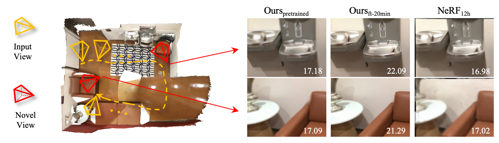
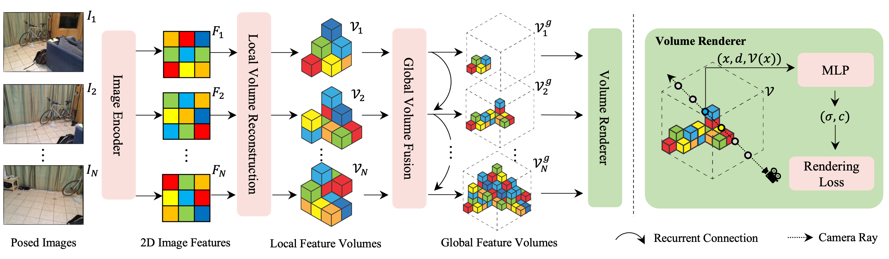

# NeRFusion: Fusing Radiance Fields for Large-Scale Scene Reconstruction (CVPR 2022 Oral)

[Project Sites](https://jetd1.github.io/NeRFusion-Web/)
 | [Paper](https://arxiv.org/abs/2203.11283) |
Primary contact: [Xiaoshuai Zhang](https://jetd1.github.io/NeRFusion-Web/)

## Note

This `dev` branch is currently **under development**. We will finish and merge this into `main` in a few days. This is a re-development of the original NeRFusion code based heavily on [nerf_pl](https://github.com/kwea123/nerf_pl), [NeuralRecon](https://github.com/zju3dv/NeuralRecon), [MVSNeRF](https://github.com/apchenstu/mvsnerf). We thank the authors for sharing their code. The model released in this repo is optimized for large-scale scenes further compared to the CVPR submission. A changelist will be provided.


## Introduction



While NeRF has shown great success for neural reconstruction and rendering, its limited MLP capacity and long per-scene optimization times make it challenging to model large-scale indoor scenes. In contrast, classical 3D reconstruction methods can handle large-scale scenes but do not produce realistic renderings. We propose NeRFusion, a method that combines the advantages of NeRF and TSDF-based fusion techniques to achieve efficient large-scale reconstruction and photo-realistic rendering. We process the input image sequence to predict per-frame local radiance fields via direct network inference. These are then fused using a novel recurrent neural network that incrementally reconstructs a global, sparse scene representation in real-time at 22 fps. This volume can be further fine-tuned to boost rendering quality. We demonstrate that NeRFusion achieves state-of-the-art quality on both large-scale indoor and small-scale object scenes, with substantially faster reconstruction speed than NeRF and other recent methods.



## Reference
Please cite our paper if you are interested   
 <strong>NeRFusion: Fusing Radiance Fields for Large-Scale Scene Reconstruction</strong>.  &nbsp;&nbsp;&nbsp; 
```
@article{zhang2022nerfusion,
  author    = {Zhang, Xiaoshuai and Bi, Sai and Sunkavalli, Kalyan and Su, Hao and Xu, Zexiang},
  title     = {NeRFusion: Fusing Radiance Fields for Large-Scale Scene Reconstruction},
  journal   = {CVPR},
  year      = {2022},
}
```


## Installation

### Requirements
All the codes are tested in the following environment:
* Linux (Ubuntu 20.04 or above)
* 32GB RAM (in order to load full size images)
* NVIDIA GPU with Compute Compatibility >= 75 and VRAM >= 6GB, CUDA >= 11.3

### Dependencies
* Python>=3.8 (installation via [anaconda](https://www.anaconda.com/distribution/) is recommended, use `conda create -n ngp_pl python=3.8` to create a conda environment and activate it by `conda activate ngp_pl`)
* Python libraries
    * Install `pytorch>=1.11.0` by `pip install torch torchvision --extra-index-url https://download.pytorch.org/whl/cu113`
    * Install `torch-scatter` following their [instruction](https://github.com/rusty1s/pytorch_scatter#installation)
    * Install `tinycudann` following their [instruction](https://github.com/NVlabs/tiny-cuda-nn#requirements) (compilation and pytorch extension)
    * Install `apex` following their [instruction](https://github.com/NVIDIA/apex#linux)
    * Install `torchsparse` following their [instruction](https://github.com/mit-han-lab/torchsparse#installation)
    * Install core requirements by `pip install -r requirements.txt`

* Cuda extension: Upgrade `pip` to >= 22.1 and run `pip install models/csrc/` (please run this each time you `pull` the code)

## Data Preparation
We follow the same data organization as the original NeRF, which expects camera parameters to be provided in a `transforms.json` file. We also support data from NSVF, NeRF++, colmap and ScanNet.

### Custom Sequence
You can test our pre-trained model on custom sequences captured under casual settings. To do so, the data should be organized in the original NeRF-style:

```
data
├── transforms.json
├── images
│   ├── 0000.jpg
    ├── 0001.jpg
    ├── ...
```

If a video is all you have (no camera parameters). You should install `ffmpeg` and `colmap`. Then follow the instructions as introduced in [instant-ngp](https://github.com/NVlabs/instant-ngp/blob/master/scripts/colmap2nerf.py) to generate the `transformas.json`.

## Inference using Pre-trained Network
```bash
python train.py --dataset_name scannet --root_dir DIR_TO_SCANNET_SCENE0000_01 --exp_name EXP_NAME --ckpt_path PATH_TO_G_CKPT
```
Please find the pre-trained weights for networks [here](https://drive.google.com/file/d/1YjwO1Q2CAn7tdnwVzDgL_iEH_m7cSiHW/view?usp=sharing).

### Per-Scene Optimization
Note: currently this script trains model from scratch. We are updating generalized pipeline.
```bash
python train.py --dataset_name DATASET_NAME --root_dir DIR_TO_SCANNET_SCENE --exp_name EXP_NAME
```

You can test using our [sample data](https://drive.google.com/file/d/1vy5whVQbMcyKTK5W0LJsTlDgCS7wGih7/view?usp=sharing) on ScanNet. You can also try evaluation using our [sample checkpoint](https://drive.google.com/file/d/1wHSPMSGhy1TVSWCYttz2JDNUTMTeI9w0/view?usp=sharing) on ScanNet:
```bash
python train.py --dataset_name scannet --root_dir DIR_TO_SCANNET_SCENE0000_01 --exp_name EXP_NAME --val_only --ckpt_path PATH_TO_SCANNET_SCENE0000_01_CKPT
```

## Training Procedure

Please download and organize the datasets in the following manner:
```
├──data/
    ├──DTU/
    ├──google_scanned_objects/
    ├──ScanNet/
```

For google scanned objects, we used [renderings](https://drive.google.com/file/d/1w1Cs0yztH6kE3JIz7mdggvPGCwIKkVi2/view?usp=sharing) from IBRNet. Download with:

```
gdown https://drive.google.com/uc?id=1w1Cs0yztH6kE3JIz7mdggvPGCwIKkVi2
unzip google_scanned_objects_renderings.zip
```

For DTU and ScanNet, please use the official toolkits for downloading and processing of the data, and unpack the root directory to the `data` folder mentioned above. Train with:

```bash
python train.py --train_root_dir DIR_TO_DATA --exp_name EXP_NAME
```

See `opt.py` for more options.


## Performance

We applied optimization on large-scale scenes in this code base, and the performance may not exactly match all numbers in the paper. Our test results with this code base is reported here. For generalized no per-scene optimization setting, we achieve 23.35/0.844/0.333 on ScanNet eight scenes, 26.23/0.925/0.169 on DTU, and 24.21/0.888/0.129 on NeRF Synthetic. For per-scene optimization setting, we achieve 27.78/0.917/0.199 on ScanNet eight scenes, 31.76/0.961/0.118 on DTU, and 29.88/0.949/0.099 on NeRF Synthetic.


## Acknowledgement
Our repo is developed based on [nerf_pl](https://github.com/kwea123/nerf_pl), [NeuralRecon](https://github.com/zju3dv/NeuralRecon) and [MVSNeRF](https://github.com/apchenstu/mvsnerf). Please also consider citing the corresponding papers. 

The project is conducted collaboratively between Adobe Research and University of California, San Diego. 

## LICENSE

The code is released under MIT License.
